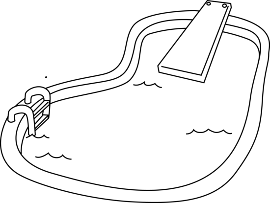

<p align="center">
  
</p>

# Pool

Pool is the easiest (at the same time most complicated) way to quickly exchange files over http between a server and some other instance.
It was built to practice Go and can be deployed as a standalone service on Windows, Linux and MacOS.

It has the following **Use-Cases** (at least for me):

- Easily transfer scripts and config files from my workstation/laptop to my homelab servers.
- Easily transfer scripts and config files from my homelab servers to my workstation/laptop.

## Features

- **Easy and fast setup**: Spin up the pool server in seconds.
- **Only curl needed**: All functionality can be accessed via simple `curl` commands.
- **Command-Line Interface**: Interact with the pool using the `poolctl` script for more convenience.
- **Web Interface**: A more or less user-friendly web interface for managing files in the pool.
- **File Operations**: Support for listing, retrieving, pushing, pulling, and deleting files.

## Getting Started

1. Download the latest release.
2. Unpack the archive.
3. Start the pool server.

    ```bash
    ./pool [ -addr "localhost:80" -path "./pool-files" ]
    ```

### Prerequisites

- curl (for command-line interactions)
- jq (optional, for formatted output in command-line)