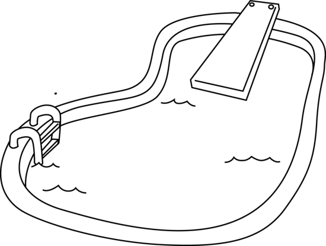

<p align="center">
  
</p>

# Pool

Pool is an easy and quick way to exchange files over HTTP between two computers.
It was built to practice Go and can be deployed as a standalone service on Windows, Linux and MacOS.

It has the following **Use-Cases** (at least for me):

- Easily transfer scripts and config files from my workstation to my homelab servers and the other way around.
- Quickly share my clipboard with another computer on my home network.

## Features

- **Easy and fast setup**: Spin up the pool server in seconds.
- **Only curl needed**: All functionality can be accessed via simple `curl` commands.
- **Command-Line Interface**: Interact with the pool using the `poolctl` script for more convenience.

  ```txt
  Usage: poolctl <command> [options]

  Commands:
    ls|list <filename|pattern>   List file(s)
    get|cat <filename>           Get file contents (raw)
    push <path-to-file>          Push file
    pull <filename|pattern>      Pull file(s)
    rm|remove <filename|pattern> Remove file(s)
    c|clipboard-push             Push clipboard contents
    v|clipboard-pull             Pull clipboard contents
    install                      Install this script
  ```

- **Web Interface**: A more or less user-friendly web interface for managing files in the pool.
- **File Operations**: Support for listing, retrieving, pushing, pulling, and deleting files.
- **Clipboard Operations**: Quickly share clipboard content to pool or retrieve it

## Getting Started

### Using a precompiled binary

1. Download the [latest release](https://github.com/marcow03/pool/releases)
2. Unpack the archive
3. Start the pool server

    ```txt
    ./pool [ -addr "localhost:80" -path "./pool-files" ]
    ```

### Using Docker

```sh
docker run --name pool -v ./pool-files:/data ghcr.io/marcow03/pool:latest
```

## Prerequisites (client-side and only MacOS/Linux)

- `curl` (for command-line interactions)
- `jq` (optional, for formatted output in command-line)
- `pbcopy`/`pbpaste` or `xclip` (to use clipboard functionality)
